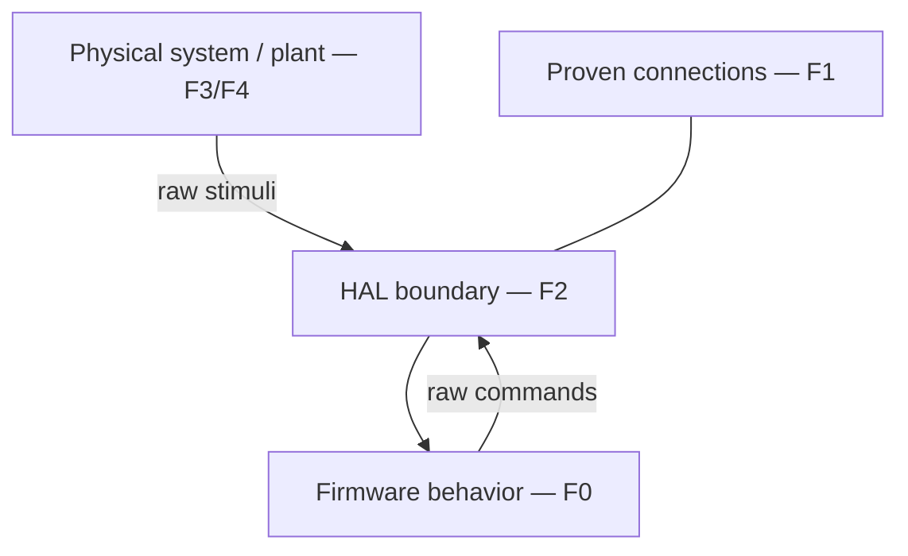

# GM P4 1227165 ECM simulator — theory of operation

## Document control

| Field | Value |
| --- | --- |
| System | GM P4 engine control module (ECM), service number 1227165 |
| Firmware basis | Supplied 9340 image and corrected BUA source/listing provenance |
| Firmware authority | `evidence/firmware/bua-hac.lst` |
| Implementation | Strict-C89 behavioral port and deterministic PC simulator |
| Revision | 1.0 |
| Status | Controlled engineering publication |
| Detailed authority | Linked reference chapters and hardware/firmware cross-reference |

This document is the master operational description of the repository's
evidence-supported system. It explains how the supplied program image,
processor-visible hardware, MEMCAL, portable C implementation, and simulator
fit together. It consolidates the sixteen completed theory chapters; it does
not replace their detailed address, net, calibration, implementation, and
regression records.

The behavioral port is closed against the supplied image at the documented
processor-visible boundary. That conclusion does **not** claim cycle-exact
processor emulation, complete custom-device reconstruction, electrical
equivalence, a production engine model, or safety qualification for connection
to physical hardware.

## 1. Scope and evidence method

### 1.1 Controlled identity

The hardware identity is ECM service number 1227165. The program basis is the
corrected BUA source family associated with the supplied 9340 material. `BUA`
is retained as source and label text; it is not, by itself, proof that every
external artifact represents the same calibration, MEMCAL, or board variant.

The authoritative executable record is
[`evidence/firmware/bua-hac.lst`](evidence/firmware/bua-hac.lst). Its emitted
instructions, bytes, addresses, targets, tables, and execution order control
firmware claims. `bua-hac.txt` is excluded because its corrected-revision status
has not been established. Source provenance and image differences are recorded
in the [evidence register](docs/reference/EVIDENCE_REGISTER.md) and
[`BUA_SOURCE_PROVENANCE.md`](evidence/firmware/BUA_SOURCE_PROVENANCE.md).

### 1.2 Evidence order and claim status

When evidence conflicts, this work uses the following order:

1. verified emitted instructions, addresses, and bytes;
2. calibration data together with its executable use;
3. repeatable tests, measurements, and independent cross-checks;
4. source labels and comments;
5. secondary descriptions and historical research.

Claims use the repository statuses **Confirmed**, **Strongly supported**,
**Provisional**, **Variant-dependent**, **Unknown**, and **Boundary**. Status
belongs to an individual claim, not to an entire artifact. Observable behavior
is established before a functional name is assigned. Missing device
documentation remains an explicit boundary rather than being completed by
analogy.

### 1.3 Fidelity classes

| Class | Meaning in this repository |
| --- | --- |
| F0 | Listing-backed firmware state, arithmetic, ordering, branch, table, or raw write preserved by the port. |
| F1 | Directly supported hardware connection, schematic path, physical construction, or MEMCAL relationship. |
| F2 | Raw processor-visible input, event, register state, or output observation at the hardware-abstraction-layer (HAL) seam. |
| F3 | Optional simulation assumption: sensor transfer, electrical response, engine/vehicle dynamics, actuator response, or other plant behavior. |
| F4 | External or unresolved behavior: undocumented custom-device internals, unavailable code, physical power/reset effects, or uncharacterized circuitry. |

The governing flow is:

The simulator may add an F3 plant around the F0 core, but an F3 result never
upgrades itself into firmware or hardware evidence.

## 2. System architecture

The ECM combines a processor, volatile and retained state, external program
memory, processor-visible custom peripherals, a serial analog-to-digital (A/D)
converter, discrete and event inputs, output drivers, and a removable MEMCAL.
The supplied program window is `$8000-$FFFF`; the interface exposes `A0-A14`,
`D0-D7`, `/ROMCS`, and `/ROMOE`. Eight vector words occupy `$FFF0-$FFFE`.

The custom-device boundary is central to the architecture:

- **U9** exposes the `$3FC0-$3FFF` processor-visible timing/register window.
  Firmware use establishes particular addresses for reference, injection,
  spark, dwell, knock, and status. It does not establish U9's internal timer
  topology or a complete pin-to-register specification.
- **U10** (`16034988`) is the serial A/D boundary. Firmware supplies a selector
  and receives an 8-bit raw sample through `$F1BE-$F1DF`.
- **U11** receives MEMCAL configuration and participates in oscillator, MAP,
  injector-limit, and reference-related connections. Its internal transfer
  functions remain F4.
- **U12** participates in distributor reference, cylinder/knock selection,
  ignition/EST feedback, and injector drive/current-control paths. Its internal
  thresholds, polarity, phase, and control laws remain F4.

The [processor and custom-peripheral chapter](docs/reference/PROCESSOR_MEMORY_CUSTOM_PERIPHERAL_ARCHITECTURE.md),
[U9 map](docs/reference/U9_REGISTER_WINDOW_MAP.md), and
[U11/U12 boundary chapter](docs/reference/U11_U12_FUNCTIONAL_BOUNDARIES.md)
are controlling references. Unclassified locations in `$3FC0-$3FFF` are not
assumed to be unused or reserved.

## 3. MEMCAL and calibration architecture

The MEMCAL is both program/calibration carrier and physical configuration
hardware. Its 66-contact relationship to motherboard connector J4, EPROM, two
resistor networks, populated jumpers, and CAL paths are part of the system
architecture. Photograph and direct physical evidence control the as-built
reconstruction where legible. KiCad, LTspice, measurements, and historical
notes provide supporting evidence; discrepancies remain visible.

Important established anchors include CAL42 to U11 pin 18 `OSC`, CAL56 to U12
pin 11 `CYL`, CAL61 to U11 pin 28 `MAP`, CAL59 to VIGN, and the CAL45/CAL46
common node. These are connection or configuration statements, not licenses to
invent the receiving devices' internal behavior. In particular:

- CAL42/U11 `OSC` is not automatically the U9 timer clock;
- CAL56/U12 `CYL` is not a PROM byte and must not be equated with `LC009` or
  `LC225`;
- CAL29's analog ESC route is distinct from the CAL32/U12/U9 knock-event route;
- resistor-network values or topology that remain visually or electrically
  ambiguous remain unresolved.

The detailed reconstruction is in
[MEMCAL architecture](docs/reference/MEMCAL_ARCHITECTURE.md),
[functional networks](docs/reference/MEMCAL_FUNCTIONAL_NETWORKS.md), and
[motherboard/firmware paths](docs/reference/MEMCAL_MOTHERBOARD_FIRMWARE_PATHS.md).

## 4. Reset, startup, and retained state

Reset vectors enter the source-ordered power-on path at `$C800-$C9F3`. That
path clears the specified volatile state, samples socket/checksum and mode
conditions, selects factory or normal operation, handles the optional-ROM
decision, validates retained state, performs recovery when required, and enters
normal initialization. The port preserves this order rather than replacing it
with a generic initialization routine.

Retained validation includes the listing-defined checksum computation at
`$F3A7-$F3B4`. Recovery at `$F434-$F446` stores `$8000` in both save-area marker
words and initializes all sixteen block-learn-memory (BLM) cells to `$80`.
Normal startup then establishes controller state, initial sensor samples,
engine-running/reference state, injector and spark state, and initial idle-air
control (IAC) positioning before periodic operation.

Factory selection executes a separate listing-backed control and test path.
The port preserves its RAM fill, table, checksum, A/D scan, communications,
raw output exercises, and restart decisions where emitted code is available.
The external factory fixture and FMD exchange remain boundaries.

Physical VIGN/VBATT rail timing, keep-alive supply behavior, processor reset
electrical consequences, unavailable optional code at `$5800`, and vector
targets at external `$6000` remain F4. The simulator exposes decisions and
events at F2; it does not claim to reproduce those physical mechanisms.

## 5. Runtime scheduler and event model

Ordinary IRQ service has a 6.25-ms cadence. The source alternates odd and even
minor paths, so each minor path executes every 12.5 ms. A one-of-sixteen major
dispatcher selects one segment per IRQ; each particular major segment recurs
every 100 ms. Common service ordering, including the 6.25-ms IAC motor
executor, is preserved.

| Execution domain | Established cadence or trigger | Principal role |
| --- | --- | --- |
| Common IRQ | 6.25 ms | common acquisition/service, IAC one-step execution, shared state |
| Odd minor | 12.5 ms | airflow/load/fuel-oriented work |
| Even minor | 12.5 ms | reference/spark/O2-oriented work |
| Major segment | one of 16 per IRQ; 100 ms per segment | slower state machines, diagnostics, outputs, accessories |
| Reference event | external engine event | occurrence/period/counter state for RPM, injection, dwell, and spark |

Reference events are not scheduler ticks. A host or target supplies raw engine
events/state through the HAL; firmware consumes them in the established source
order. Collapsing both domains into one periodic host loop changes observable
firmware behavior. The detailed order is documented in
[Interrupt and scheduler architecture](docs/reference/INTERRUPT_SCHEDULER_ARCHITECTURE.md).

## 6. Input acquisition and signal processing

Firmware explicitly selects U10 channels and receives an 8-bit sample. Normal
operation does not perform one continuous universal scan; cadence depends on
common, minor, major, startup, or factory execution context.

| Selector | Channel/net | Supplied-image role |
| ---: | --- | --- |
| `$00` | AN0 `MAP2` | factory scan; no explicit normal request found |
| `$10` | AN1 `VOLT` | voltage/battery-related processing |
| `$20` | AN2 `O2` | oxygen acquisition and filtering |
| `$30` | AN3 `MAP` | factory scan; no explicit normal request found |
| `$40` | AN4 `CTS` | coolant conversion |
| `$50` | AN5 `TPS` | throttle acquisition, learning, normalization |
| `$60` | AN6 `PUMPVOLT` | pump-voltage diagnostics |
| `$70` | AN7 `DIAG` | mode selection |
| `$80` | AN8 `MAT` | air-temperature processing |
| `$90` | AN9 `ESC` | factory scan; no explicit normal request found |
| `$A0` | AN10 `VMAF` | analog mass-airflow path |
| `$B0` | unresolved | factory scan only; channel identity unresolved |

Raw counts, learned references, filtered state, and engineering-unit or plant
interpretation remain separate. Representative states include TPS raw `$0081`
and normalized `$0082`, VMAF raw `$00ED` and airflow `$00EA:$00EB`, voltage
`$007E`, pump voltage `$007F`, MAT `$012B/$0060`, and current load `$0063`.

The supplied image's principal load path is VMAF-derived airflow multiplied by
reference period `$0095:$0096` at `$D769-$D7A0`. Physical MAP/MAP2 resources
and CAL61/U11 `MAP` exist, but the evidence does not make them the ordinary
producer of `$0063`. Vehicle speed and distributor reference are discrete/event
paths, not A/D channels.

## 7. Reference, RPM, dwell, spark, and knock

Conditioned distributor activity reaches U12 `REF`; U12 presents reference-
related connections to U9/U11, and U9 makes occurrence and timing state
processor-visible. Firmware qualifies reference state, derives RPM using the
image's supported V8 geometry, and maintains no-reference and engine-running
state. Four distributor reference pulses per crankshaft revolution are strongly
supported; a reference interval represents 90 crank degrees.

Spark production combines calibrated main and coolant terms, startup behavior,
mode terms, limits, hot-restart effects, and knock retard. At `$D20C-$D267`,
the firmware converts desired angle to timing relative to reference period and
stages U9 state. Important processor-visible locations include `$3FC8` current
period state, `$3FDC` dwell period, `$3FE4/$3FE6` next-dwell state, `$3FE8`
fire/fall delta, `$3FEC` last-reference counter, `$3FF6` reference-to-fire
offset, and `$3FFC` control/status.

Knock is a separate event path. CAL32/external `KNOCK#` reaches U12 and U9;
firmware consumes changes in `$3FCA` at `$D0D1-$D157`, accumulates retard in
`$00A5`, applies it to spark, and recovers it in Segment A at `$EB3A-$EB59`.
Error 43 uses the associated activity checks. CAL29/U10 AN9 remains a distinct
analog ESC observation and is not inserted into this event path.

U9/U12 physical edge generation, timer scaling, EST and bypass polarity,
ignition-coil current, and exact feedback transformation remain F4. Error 42
establishes firmware feedback-consistency behavior, not the undocumented
electrical implementation.

## 8. Airflow, fuel, and injection

Normal airflow begins with U10 selector `$A0`. `$F7AC-$F7B6` stores VMAF raw
state at `$00ED`; subsequent processing produces airflow `$00EA:$00EB`.
`$D769-$D7A0` combines airflow with reference period to produce load `$0063`,
while shifting prior values through `$0061/$0062`.

The fuel path then selects cranking or normal operation and applies the
listing-defined commanded air/fuel relationship, startup and power enrichment,
oxygen feedback, BLM correction, acceleration enrichment, deceleration fuel
cutoff (DFCO), battery-related compensation, pulse-width shaping, and service
gates. The sixteen-cell BLM uses a four-by-four airflow/RPM selection for this
image (`LC017=0`) and remains distinct from the faster closed-loop correction.

The established command chain is:

`VMAF -> airflow -> load/fuel terms -> corrected pulse width -> permitted injector service -> U9 $3FD0`

U9 `$3FCE` is independently exercised as EFI delay. U9 `INJS/INJA`, U12
injector drive/current control, U11 `INJ/INJLIMP`, Q1, and the external
injector circuit form the hardware envelope. Firmware calculation and raw
commands are F0/F2; phase, current limiting, waveform, opening delay, fuel
pressure, flow, and combustion are F3/F4.

## 9. Idle-air control

Firmware builds a coolant- and mode-dependent target idle, applies minimum-
position and anticipation state, and runs the established feedback regulator
every 50 ms. The regulator preserves source-specific proportional, derivative,
deadband, residual, and fractional-step behavior. It produces a packed
direction/magnitude request; a separate 6.25-ms motor service consumes at most
one step and updates phase and position bookkeeping.

Throttle follower and A/C, fan, and calibrated auxiliary load anticipation add
feed-forward demand without replacing feedback regulation. Startup establishes
initial position state. During key-off, `$D370-$D3DB` requests closure to the
hard stop, initializes the software counter, then reopens toward calibrated
park `LC62F=144` through repeated ordinary motor services.

The `$002C` HAL observation is software position bookkeeping, not measured
pintle position. Winding current, direction at the connector, missed steps,
hard-stop mechanics, airflow per step, and engine response remain F3/F4.

## 10. Emissions, accessories, and transmission

The major loop qualifies secondary-air (AIR), exhaust-gas-recirculation (EGR),
canister-purge/CCP, cooling-fan, and air-conditioning requests using calibrated
thresholds, delays, and hysteresis. A/C and fan state also feed the IAC
anticipation path. Subsystem request state remains distinct from common output
staging and from the physical valve, relay, fan, or compressor state.

Transmission logic combines selector/transmission state, vehicle speed, and
Segment-E torque-converter-clutch (TCC) qualification. Three stages must remain
distinct: firmware TCC request, raw ECM output, and actual powered/hydraulic
clutch state. The external brake series-power path is not silently rewritten as
an ECM software input. Gear ratios, converter slip, and vehicle dynamics in the
optional PC drive model are F3 assumptions; driver, solenoid, and hydraulic
behavior not directly established remain F4.

## 11. Output staging and electrical interfaces

Major Segment 1 `$EDA3-$EF03` is the common raw output-staging block. It
preserves battery qualification, ordinary and field-diagnostic engine-off
patterns, normal subsystem selection, Mode-4 pulse-width-modulation overrides,
and direct writes to `$3FCC`, `$3FD2`, `$3FD4`, `$3FD6`, `$3FD8`, and `$4004`.
The output regression freezes the integrated raw-stage signature `FAADF8A6`.

A register value is not automatically a voltage, current, relay state, valve
position, or actuator force. The supported output sequence is:

`firmware request (F0) -> raw processor-visible write (F0) -> proven connection (F1) -> HAL observation (F2) -> optional plant interpretation (F3)`

Undocumented driver or custom-device transformation stays F4. This applies to
injectors and ignition as well as IAC, TCC, AIR, EGR, purge, fan, A/C, service
lamp, and factory-test outputs. Raw values such as `0`, `1`, `$D000`, or
`$DFFF` do not establish active-high/low, sourcing/sinking, or energized-load
semantics by themselves.

## 12. Diagnostics and communications

Diagnostics separate current qualification, stored history, service-lamp
request, and physical lamp behavior. Fault-specific counters and state qualify
conditions before history is latched or cleared. Field-service mode sequences
flash codes through firmware state; electrical lamp polarity remains at the
output boundary.

The normal 160-baud asynchronous link is a pulse-width-coded display stream.
The completed raw HAL retains its diagnostic and factory managers, processor-
visible timing/state, and output observations without claiming external wire
voltage or scan-tool presentation.

The 8192-baud path uses the sole device `$80` serial core initialized at
`$C9F4` and implemented through `$FA58-$FC71`. Firmware validates receive
state/checksum, constructs Modes 0-4 responses, and advances transmit state.
Mode 4 becomes active only through the scheduler-facing lifecycle at
`$CB67-$CB72`; entry-only commands and exit cleanup retain their source order.

External ALDL transceiver voltage, polarity, collision behavior, precise
physical bit timing, unavailable memory reads, and scan-tool formatting remain
F3/F4. Protocol state is not evidence of those electrical properties.

## 13. Key-off, shutdown, and exceptional modes

The live lifecycle composes reset-vector power-on, ordinary IRQ operation, the
`$D6D1-$D769` ignition/key-off transition, retained-state work, IAC homing, and
the terminal `$D6EA` software-interrupt (SWI) powerdown request. BLM commit via
LF447 occurs in its documented order. If ignition returns while the software
still executes, restart follows the established path rather than a host-created
shortcut.

The vectors at `$FFF0-$FFFE` target `$6000`, `$C9F4`, `$F27B`, `$6000`, and
four copies of `$C800`; `$F27B` is an immediate return-from-interrupt. What the
processor, power supply, keep-alive circuitry, or external `$6000` target does
after SWI/reset is outside the supplied image. The HAL reports the software
request; it does not simulate physical loss of power as an F0 fact.

## 14. C port and embedded boundary

The implementation is intentionally a single strict-C89 translation unit:
`main.c` includes the fragments under `src/`, `simulation/`, and `tests/`.
Exact-width assumptions are enforced with compile-time checks, and explicitly
encoded byte/word operations preserve big-endian processor-visible behavior.
The code fragments are not intended to compile independently.

`src/hal_interface.inc.h` is the explicit raw seam. It supplies A/D, reference,
discrete, communications, power/startup, and factory stimuli and observes U9,
parallel-I/O, injector, IAC, and common output state. Target-specific timers,
vectors, A/D and capture peripherals, serial transceivers, output drivers,
retained memory, watchdog, and physical power behavior belong behind that seam.

An embedded port must retain F0 order and widths while replacing F2 mechanics.
It must not migrate the PC's F3 engine/vehicle plant into firmware or fill F4
U9/U11/U12 behavior for convenience. The controlled sequence and exit criteria
are in the [embedded and HIL roadmap](docs/EMBEDDED_HIL_IMPLEMENTATION_ROADMAP.md).

## 15. Simulation and verification

Verification has three complementary layers:

- focused regressions preserve individual arithmetic, state machines, tables,
  and raw interfaces;
- scheduler and lifecycle regressions prove source-order composition;
- deterministic PC scenarios exercise closed-loop interaction with explicitly
  assumed F3 engine and transmission plants.

`make test` compiles only `main.c` using `gcc -std=c89 -Wall -Wextra -pedantic`,
runs the complete regression program, checks every Makefile-gated result and
signature, and rejects genuine `FAIL` output. Frozen signatures include the
normal-operation signature `4BA6B7C6`, transmission-aware signature `9732D09B`,
Segment-D diagnostic signature `F357A5F2`, Segment-1 output signature
`FAADF8A6`, and ignition-lifecycle signature `16D17C9C`. Later raw-HAL and
lifecycle signatures are documented by the verification chapter and audits.

Signatures are broad deterministic change detectors. They do not replace
explicit assertions, prove untested paths, or establish physical truth. A
change that preserves a signature can still be wrong; a deliberate behavior
change requires source evidence, focused checks, integration checks, and a
reviewed baseline update.

## 16. Explicit unresolved boundaries

The following are intentionally unresolved or external to the supplied image:

- undocumented internals, transfer functions, phase, polarity, thresholds,
  timer scaling, and current-control behavior of U9, U11, and U12;
- unclassified U9 `$3FC0-$3FFF` locations and unproven pin/register mappings;
- U10 selector `$B0`, analog reference/accuracy details, and variant-specific
  normal use of MAP2, MAP, or ESC channels;
- exact physical relationships among `OSC`, `CYL`, distributor reference,
  ignition, EST/bypass feedback, and knock events beyond established paths;
- injector and ignition waveforms, driver protection, coil/injector current,
  output polarity, and load electrical behavior;
- IAC mechanics and airflow, relay/solenoid/valve/fan/compressor response, TCC
  hydraulics, sensor transfer functions, and engine/vehicle dynamics;
- optional code at `$5800`, external vector targets at `$6000`, the factory
  fixture/FMD implementation, and unavailable external memory contents;
- physical reset, rail timing, standby/keep-alive power, watchdog, and
  processor consequences after SWI or power transition;
- variant applicability of external photographs, MEMCAL networks,
  calibrations, and historical artifacts not directly tied to this unit.

These are engineering work items, not gaps to be closed by plausible guesses.
New evidence should update the evidence register and cross-reference first,
then the affected detailed chapter and this synthesis.

## Appendix A. Consolidated address and register index

This index collects the principal processor-visible locations used in the
system narrative. Functional names describe established executable use; they
do not imply undocumented electrical or custom-device behavior.

### A.1 RAM and software state

| Address/range | Established role | Detailed reference |
| --- | --- | --- |
| `$002C` | IAC software position bookkeeping | [Idle-air control](docs/reference/IDLE_AIR_CONTROL_THEORY.md) |
| `$005B-$005F` | coolant conversion and diagnostic state | [Sensor acquisition](docs/reference/SENSOR_ACQUISITION_FILTERING_THEORY.md) |
| `$0061-$0063` | prior and current load state | [Airflow/fuel/injection](docs/reference/AIRFLOW_FUEL_INJECTOR_THEORY.md) |
| `$0064` | common temporary A/D result | [A/D acquisition](docs/reference/ADC_SENSOR_ACQUISITION.md) |
| `$006F/$0071/$0073` | oxygen acquisition/filter state | [Sensor acquisition](docs/reference/SENSOR_ACQUISITION_FILTERING_THEORY.md) |
| `$007E` | persistent `VOLT` sample | [Sensor acquisition](docs/reference/SENSOR_ACQUISITION_FILTERING_THEORY.md) |
| `$007F` | persistent `PUMPVOLT` sample | [Sensor acquisition](docs/reference/SENSOR_ACQUISITION_FILTERING_THEORY.md) |
| `$0081/$0082` | raw and normalized TPS state | [Sensor acquisition](docs/reference/SENSOR_ACQUISITION_FILTERING_THEORY.md) |
| `$0086/$0087` | learned closed-throttle state | [Sensor acquisition](docs/reference/SENSOR_ACQUISITION_FILTERING_THEORY.md) |
| `$0095:$0096` | reference-period state used by load/fuel processing | [Airflow/fuel/injection](docs/reference/AIRFLOW_FUEL_INJECTOR_THEORY.md) |
| `$00A5` | accumulated knock-retard state | [ESC/knock chain](docs/reference/ESC_KNOCK_SIGNAL_CHAIN.md) |
| `$00DD-$00DE` | transient TPS state | [Sensor acquisition](docs/reference/SENSOR_ACQUISITION_FILTERING_THEORY.md) |
| `$00EA:$00EB` | processed airflow word | [Airflow/fuel/injection](docs/reference/AIRFLOW_FUEL_INJECTOR_THEORY.md) |
| `$00ED/$00EF` | raw and intermediate VMAF state | [Airflow/fuel/injection](docs/reference/AIRFLOW_FUEL_INJECTOR_THEORY.md) |
| `$012B/$0060` | complemented raw and processed MAT state | [Sensor acquisition](docs/reference/SENSOR_ACQUISITION_FILTERING_THEORY.md) |
| `$0152/$0153/$0156/$0157` | Mode-4 raw PWM override state | [Output staging](docs/reference/OUTPUT_STAGING_ELECTRICAL_INTERFACES.md) |
| `$017B-$0186` | factory-test sequential A/D snapshot | [A/D acquisition](docs/reference/ADC_SENSOR_ACQUISITION.md) |

### A.2 Processor-visible peripheral locations

| Address/range | Established role | Detailed reference |
| --- | --- | --- |
| `$3FC8` | current spark/reference-period state | [U9 register map](docs/reference/U9_REGISTER_WINDOW_MAP.md) |
| `$3FCA` | knock-event quantity consumed by firmware | [ESC/knock chain](docs/reference/ESC_KNOCK_SIGNAL_CHAIN.md) |
| `$3FCC` | Segment-1 raw MPU output word | [Output staging](docs/reference/OUTPUT_STAGING_ELECTRICAL_INTERFACES.md) |
| `$3FCE` | EFI delay state | [Ignition/injection chain](docs/reference/IGNITION_INJECTION_SIGNAL_CHAIN.md) |
| `$3FD0` | synchronous injector command | [Airflow/fuel/injection](docs/reference/AIRFLOW_FUEL_INJECTOR_THEORY.md) |
| `$3FD2/$3FD4/$3FD6/$3FD8` | Segment-1 raw MPU output words | [Output staging](docs/reference/OUTPUT_STAGING_ELECTRICAL_INTERFACES.md) |
| `$3FDC` | dwell-period value | [Reference/RPM/dwell/spark](docs/reference/REFERENCE_RPM_DWELL_SPARK_THEORY.md) |
| `$3FE4/$3FE6` | next-dwell timing and update state | [Reference/RPM/dwell/spark](docs/reference/REFERENCE_RPM_DWELL_SPARK_THEORY.md) |
| `$3FE8` | current fire/fall delta | [Reference/RPM/dwell/spark](docs/reference/REFERENCE_RPM_DWELL_SPARK_THEORY.md) |
| `$3FEC` | counter value at last reference | [Reference/RPM/dwell/spark](docs/reference/REFERENCE_RPM_DWELL_SPARK_THEORY.md) |
| `$3FF6` | reference-to-fire offset | [Reference/RPM/dwell/spark](docs/reference/REFERENCE_RPM_DWELL_SPARK_THEORY.md) |
| `$3FFC` | control/status word used by EST/bypass and other modes | [U9 register map](docs/reference/U9_REGISTER_WINDOW_MAP.md) |
| `$4004` | parallel-I/O byte modified by Segment 1 | [Output staging](docs/reference/OUTPUT_STAGING_ELECTRICAL_INTERFACES.md) |

### A.3 Executable regions and external boundaries

| Address/range | Established role | Detailed reference |
| --- | --- | --- |
| `$5800` | optional-ROM boundary; code unavailable | [Startup/shutdown](docs/reference/STARTUP_SHUTDOWN_EXCEPTIONAL_MODES.md) |
| `$6000` | external vector destination; behavior unavailable | [Startup/shutdown](docs/reference/STARTUP_SHUTDOWN_EXCEPTIONAL_MODES.md) |
| `$8000-$FFFF` | supplied program window | [Processor/memory architecture](docs/reference/PROCESSOR_MEMORY_CUSTOM_PERIPHERAL_ARCHITECTURE.md) |
| `$C800-$C9F3` | reset and power-on sequence | [Startup/shutdown](docs/reference/STARTUP_SHUTDOWN_EXCEPTIONAL_MODES.md) |
| `$C9F4`, `$FA58-$FC71` | device `$80` SCI core | [Diagnostics/ALDL](docs/reference/DIAGNOSTICS_ALDL_COMMUNICATION_THEORY.md) |
| `$CB67-$CB72` | scheduler-facing Mode-4 activation | [Diagnostics/ALDL](docs/reference/DIAGNOSTICS_ALDL_COMMUNICATION_THEORY.md) |
| `$D0D1-$D157` | knock-event consumption and retard | [ESC/knock chain](docs/reference/ESC_KNOCK_SIGNAL_CHAIN.md) |
| `$D20C-$D267` | spark angle-to-time staging | [Reference/RPM/dwell/spark](docs/reference/REFERENCE_RPM_DWELL_SPARK_THEORY.md) |
| `$D370-$D3DB` | IAC reset/homing state machine | [Idle-air control](docs/reference/IDLE_AIR_CONTROL_THEORY.md) |
| `$D6D1-$D769` | key-off transition and adjacent lifecycle path | [Startup/shutdown](docs/reference/STARTUP_SHUTDOWN_EXCEPTIONAL_MODES.md) |
| `$D769-$D7A0` | airflow/reference-period load producer | [Airflow/fuel/injection](docs/reference/AIRFLOW_FUEL_INJECTOR_THEORY.md) |
| `$D6EA` | terminal SWI software-powerdown request | [Startup/shutdown](docs/reference/STARTUP_SHUTDOWN_EXCEPTIONAL_MODES.md) |
| `$EDA3-$EF03` | Segment-1 raw output staging | [Output staging](docs/reference/OUTPUT_STAGING_ELECTRICAL_INTERFACES.md) |
| `$F1BE-$F1DF` | common U10 A/D transaction | [A/D acquisition](docs/reference/ADC_SENSOR_ACQUISITION.md) |
| `$F3A7-$F3B4` | retained checksum computation | [Startup/shutdown](docs/reference/STARTUP_SHUTDOWN_EXCEPTIONAL_MODES.md) |
| `$F434-$F446` | retained-state recovery initialization | [Startup/shutdown](docs/reference/STARTUP_SHUTDOWN_EXCEPTIONAL_MODES.md) |
| `$FFF0-$FFFE` | emitted vector table | [Startup/shutdown](docs/reference/STARTUP_SHUTDOWN_EXCEPTIONAL_MODES.md) |

The complete function-to-listing, RAM/register, calibration, schematic, C, and
test mapping remains in the
[hardware/firmware cross-reference](docs/reference/HARDWARE_FIRMWARE_CROSS_REFERENCE.md).

## Appendix B. Detailed chapter map

| Chapter | Controlling reference |
| ---: | --- |
| 1 | [System overview and evidence method](docs/reference/README.md) |
| 2 | [Power, reset, retained power, startup, and shutdown](docs/reference/STARTUP_SHUTDOWN_EXCEPTIONAL_MODES.md) |
| 3 | [Processor, memory, and custom peripherals](docs/reference/PROCESSOR_MEMORY_CUSTOM_PERIPHERAL_ARCHITECTURE.md) |
| 4 | [MEMCAL architecture and reconstruction](docs/reference/MEMCAL_ARCHITECTURE.md) |
| 5 | [Interrupt and scheduler architecture](docs/reference/INTERRUPT_SCHEDULER_ARCHITECTURE.md) |
| 6 | [Reference, RPM, dwell, and spark](docs/reference/REFERENCE_RPM_DWELL_SPARK_THEORY.md) |
| 7 | [Sensor acquisition and filtering](docs/reference/SENSOR_ACQUISITION_FILTERING_THEORY.md) |
| 8 | [Airflow, fuel, and injection](docs/reference/AIRFLOW_FUEL_INJECTOR_THEORY.md) |
| 9 | [Idle-air control](docs/reference/IDLE_AIR_CONTROL_THEORY.md) |
| 10 | [Emissions and accessory control](docs/reference/EMISSIONS_ACCESSORY_CONTROL_THEORY.md) |
| 11 | [Transmission and TCC](docs/reference/TRANSMISSION_TCC_THEORY.md) |
| 12 | [Diagnostics and ALDL](docs/reference/DIAGNOSTICS_ALDL_COMMUNICATION_THEORY.md) |
| 13 | [Output staging and electrical interfaces](docs/reference/OUTPUT_STAGING_ELECTRICAL_INTERFACES.md) |
| 14 | [Startup, shutdown, and exceptional modes](docs/reference/STARTUP_SHUTDOWN_EXCEPTIONAL_MODES.md) |
| 15 | [C port and embedded migration](docs/reference/C_PORT_ARCHITECTURE_EMBEDDED_MIGRATION.md) |
| 16 | [Simulation and verification](docs/reference/SIMULATION_VERIFICATION_THEORY.md) |

The [theory-of-operation index](docs/reference/THEORY_OF_OPERATION_INDEX.md)
retains the acceptance criteria and supporting signal-chain references for the
sixteen-chapter source set.

## Appendix C. Glossary

| Term | Meaning |
| --- | --- |
| A/C | Air conditioning. |
| A/D | Analog-to-digital conversion. |
| AE | Acceleration enrichment. |
| AFR | Air/fuel ratio. |
| AIR | Secondary-air management system. |
| ALDL | Assembly Line Diagnostic Link. |
| BLM | Block-learn memory; retained adaptive fuel-correction state. |
| CCP | Canister-control purge; used here for the canister-purge function. |
| CTS | Coolant temperature sensor. |
| DFCO | Deceleration fuel cutoff. |
| ECM | Engine control module. |
| EGR | Exhaust-gas recirculation. |
| ESC | Electronic spark control; the analog observation path is distinct from the knock-event path. |
| EST | Electronic spark timing. |
| FMD | Factory-mode data/exchange boundary used by the factory-test path. |
| HAL | Hardware abstraction layer; the raw processor-visible F2 seam. |
| HIL | Hardware-in-the-loop verification. |
| IAC | Idle-air control. |
| IRQ | Interrupt request; ordinary periodic firmware service in this document. |
| MAF | Mass airflow. |
| MAP | Manifold absolute pressure. |
| MAT | Manifold air temperature. |
| MEMCAL | Removable memory/calibration and configuration carrier. |
| MPU | The custom processor-visible peripheral/register resource named by the source material. |
| PROM | Programmable read-only memory containing program and calibration data. |
| PWM | Pulse-width modulation. |
| RPM | Revolutions per minute. |
| SCI | Serial communications interface used by the 8192-baud path. |
| SWI | Software interrupt; used by the terminal powerdown request path. |
| TCC | Torque-converter clutch. |
| TPS | Throttle position sensor. |
| VIGN | Ignition-switched supply/sense domain. |
| VMAF | Analog mass-airflow voltage net presented to U10. |
| VSS | Vehicle-speed signal. |
