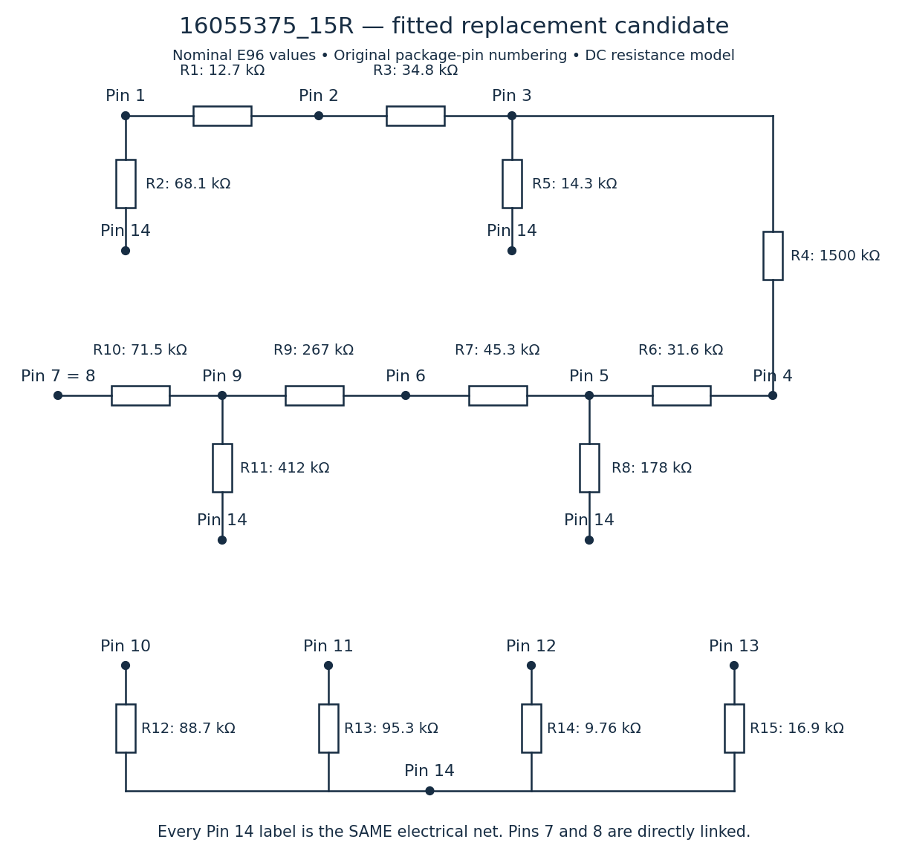
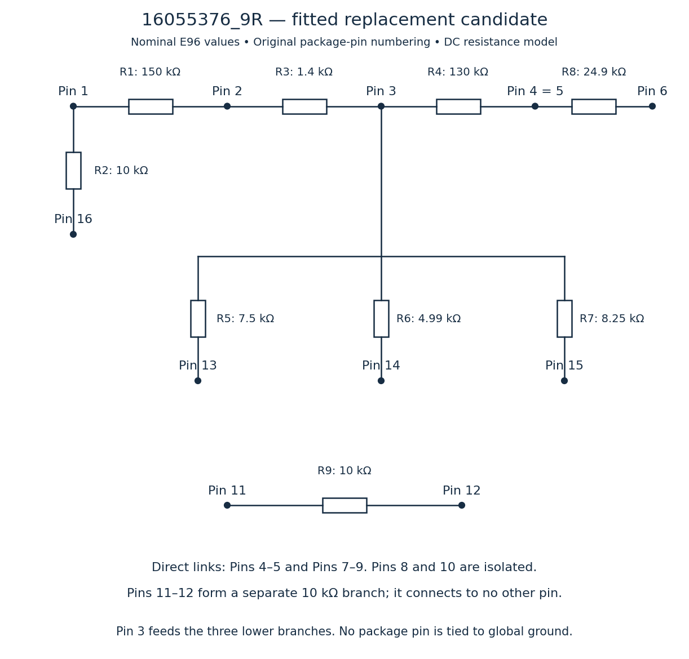

# NetRes reconstruction from original measured resistance matrices

## Result and owner-confirmed target

On 2026-10-06 the owner confirmed that the original ODS contains measurements
between pins on the original NetRes devices and that those readings are the
target for the final replacement. The previous hand reconstruction was an
imperfect approximation, not a claim of exact equivalence.

The workbook defines original terminal resistance targets. Photographs define
the actual population of the earlier hand reconstruction. Neither replaces the
other: models and new candidates are judged against the original measurements;
as-built statements are judged against physical evidence. Instrument, temperature,
test voltage and measurement uncertainty were not specified.

These candidates were fitted from the matrices without using the old topology
as the optimization starting network. All positive-conductance terminal branches
were initially available; branches were pruned and values refitted.

| Candidate | Nonzero resistors | Nominal E96 RMS pair error | Nominal E96 worst pair error | Worst bound with ±1% resistors |
| --- | ---: | ---: | ---: | ---: |
| 16055375 compact | 14 | 0.947% | 3.029% | 3.999% |
| **16055375 preferred accuracy/count balance** | **15** | **0.306%** | **0.635%** | **1.642%** |
| 16055375 additional branch | 16 | 0.306% | 1.015% | 2.005% |
| **16055376** | **9** | **0.595%** | **1.908%** | **2.889%** |

RMS and maxima use all positive measured pairs: 90 for 16055375 and 45 for
16055376. Measured zero pairs are enforced as direct links and excluded from
percentage denominators. Nominal errors assume exact labeled resistor values.
The tolerance bound uses monotonic effective resistance: with each resistor
within ±1%, every pair lies between its nominal result multiplied by 0.99
and 1.01. It excludes measurement uncertainty, leakage, connection resistance,
temperature effects and unmodeled circuitry.

The E96 selection uses a local discrete search trading RMS and maximum error.
Consequently the rounded 15-resistor version has a smaller maximum error than
the continuous fit (0.899%) although its RMS error is larger. That is expected;
the continuous optimizer minimizes RMS relative error, not the maximum.
The 16-resistor discrete result is dominated by the 15-resistor result in this
search. It is retained for transparency, not preferred. Neither pruning nor
discrete search proves a globally optimal or minimum-component solution.

The 14-resistor option drops one weak coupling, at the cost of accuracy.
The next 13-resistor topology found by this pruning search reached 28.2% worst
ideal-value error; that does not prove all possible 13-resistor networks fail.

## 16055375 proposed connections — 15-resistor E96 version

Use original 14-terminal package numbering, not generic reconstruction J1-J16
positions or motherboard J4/CAL numbers. Directly link pins 7 and 8.
Pin 14 is a common network terminal; it is NOT a directive to connect to ground.
Every pin-14 label in the drawing denotes the same electrical net.

| Resistor | Original pins | E96 value |
| --- | --- | ---: |
| R1 | 1–2 | 12.7 kΩ |
| R2 | 1–14 | 68.1 kΩ |
| R3 | 2–3 | 34.8 kΩ |
| R4 | 3–4 | 1500 kΩ |
| R5 | 3–14 | 14.3 kΩ |
| R6 | 4–5 | 31.6 kΩ |
| R7 | 5–6 | 45.3 kΩ |
| R8 | 5–14 | 178 kΩ |
| R9 | 6–9 | 267 kΩ |
| R10 | 7–9 | 71.5 kΩ |
| R11 | 9–14 | 412 kΩ |
| R12 | 10–14 | 88.7 kΩ |
| R13 | 11–14 | 95.3 kΩ |
| R14 | 12–14 | 9.76 kΩ |
| R15 | 13–14 | 16.9 kΩ |




There are 15 nonzero resistors plus one direct pin link. This is one fewer
nonzero resistor than the documented simplified 16-branch reconstruction and
three fewer than the old 18-resistor LTspice internal model. It does not need
the generic grid's routing-resistor population or its internal construction.
It is a terminal-behavior replacement, not a reconstruction of hidden internals.

| Pair | Original measured kΩ | Earlier simplified candidate kΩ | New nominal E96 kΩ |
| --- | ---: | ---: | ---: |
| 4–9 | 231 | 370.433 | 230.659 |
| 5–9 | 202 | 353.879 | 201.958 |
| 6–9 | 187 | 373.371 | 186.348 |

The key repair is restoring appropriate coupling through the 6–9 section.
The new network has a 267-kΩ direct 6–9 branch; its measured equivalent is
186.348 kΩ because alternate paths operate in parallel. Do not confuse a
branch resistor value with the resistance measured between its terminals.

The smaller option uses [14 resistors](../evidence/memcal/fitted_models/16055375_14R_resistors.csv)
and its own [schematic](../evidence/memcal/fitted_models/16055375_14R_schematic.png).
It omits the 3–4 branch and changes some values; simply removing R4 from the
15-resistor schematic does not produce the optimized 14-resistor version.

## 16055376 proposed connections — nine-resistor E96 version

| Resistor | Original pins | E96 value |
| --- | --- | ---: |
| R1 | 1–2 | 150 kΩ |
| R2 | 1–16 | 10 kΩ |
| R3 | 2–3 | 1.4 kΩ |
| R4 | 3–4 | 130 kΩ |
| R5 | 3–13 | 7.5 kΩ |
| R6 | 3–14 | 4.99 kΩ |
| R7 | 3–15 | 8.25 kΩ |
| R8 | 4–6 | 24.9 kΩ |
| R9 | 11–12 | 10 kΩ |


Directly link pins 4–5 and pins 7–9. Pins 8 and 10 are isolated.
Pins 11–12 are a separate 10-kΩ branch, with no connection to other pins.
This uses the same nine-resistor count and terminal topology as the existing
nominal model, with values adjusted toward original measurements.
The existing nominal model's worst positive-pair error is 7.143%;
this candidate reduces it to 1.908%.



The workbook has 119 populated pair entries of 120 possible: 45 positive,
two zero, and 72 dash entries. The 12–13 cell is blank. Dash entries are
interpreted as open/disconnected in this passive model, consistent with the
remaining matrix. The unrecorded 12–13 pair is predicted open by the separate
11–12 component; it is not presented as a measured value.

## Method and limitations

For each connected component, merge exactly shorted terminals. Start with
every terminal-to-terminal conductance available. For a trial network, build
its conductance Laplacian, inject one unit of test current between each pair
and calculate the resulting voltage difference. Optimize relative resistance
errors with nonnegative conductance bounds, then remove weak branches and
refit; at small counts, test every possible single-edge removal. Finally choose
nearby E96 values using a local coordinate search. All values are in kΩ.

The exact matrix inversion implies some negative conductances because the
recorded numbers are not perfectly consistent with an exact passive resistor
network. Negative resistors are never used in the proposals. Small fitting
residuals are compatible with rounded/uncertain readings; no individual
measurement is silently corrected. Hidden original internal nodes are not
needed to reproduce terminal DC behavior approximately.

This establishes resistance fits, not electrical validation on the ECM.
The model does not establish capacitance, voltage-dependent response, power
rating, thermal behavior or undocumented functions of the original devices.
Bench-check a new isolated network against the measured matrix before replacing
hardware. A resistance match alone does not establish engine-system suitability.
Original archival files and prior as-built photographs are unchanged.

## Reproduce and review

The fitting tools require NumPy and SciPy; circuit previews additionally require
Matplotlib. The original firmware's strict C89 build does not depend on them.

```text
python tools/fit_netres.py
python tools/summarize_netres_fit.py
python tools/draw_netres_candidates.py
```

Tested numerical environment: NumPy/SciPy/Matplotlib versions are recorded in
the Step-179 audit. The original ODS hash remains the manifest hash.
See [model files](../evidence/memcal/fitted_models/README.md) for resistor lists,
SPICE subcircuits, full comparisons, accuracy table and optimizer results.
